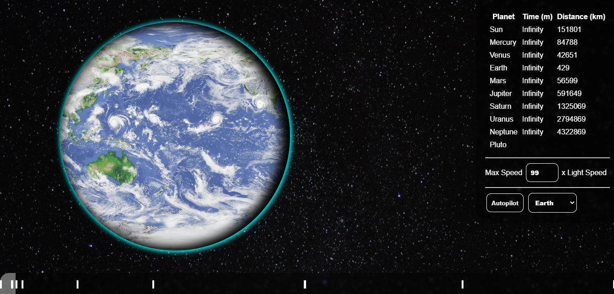
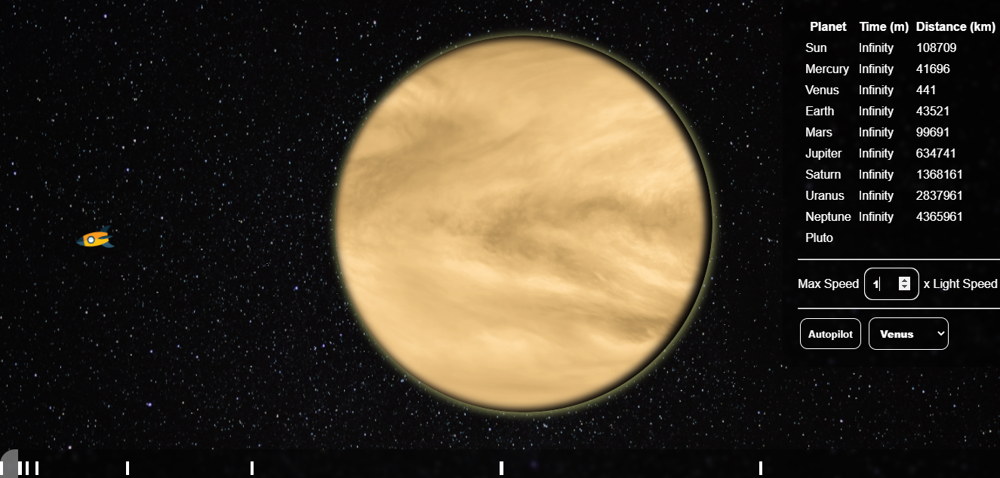
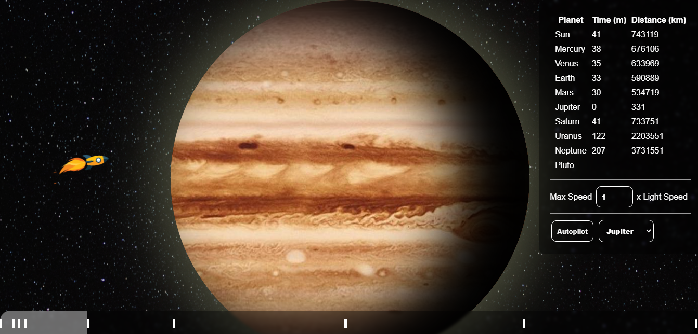

# Solar System Real Distance
## Description
A very simple web page that represents the space from the sun to the last planet on the solar system. 
<br/>
The distances between planets are real (It will take you real 8 minutes to reach the earth from the sun).

## Styling
All planets have rotation, shadow, and halo animations that make them look more realistic. <br>
If you want planets to appear in their real size relative to the sun go the [script.js](./assets/javascript/script.js) file and comment the 
```planetsSize()``` function.

## Usage
Just open the index.html file.
<br>
Or [Try it here](https://htmlpreview.github.io/?https://github.com/Maliklar/solar-system/blob/main/index.html)

## Screenshots

<br>

<br>


<br>
